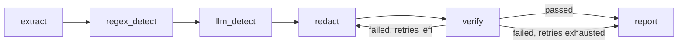

# RedactGuard

PII redaction for PDF/DOCX documents that doesn't just redact — it **verifies
the redaction actually worked** by re-extracting the output and checking
nothing sensitive survived, looping back to redaction automatically if it
did. Most redaction tools trust the redaction step blindly; this one treats
that trust as the actual bug to design around.

**[▶ Live demo](https://redactguard-66iybemnkbkxq6ngdvxqkx.streamlit.app/)** · **[Sample document to try it with](samples/)** · **[Implementation guide](docs/IMPLEMENTATION_GUIDE.md)** (design rationale, written before any code)

## Why this exists

A naive PDF redactor draws a black rectangle over sensitive text. It looks
correct. The text underneath is still there — fully selectable, copyable,
and extractable by anyone who opens the file. This is a well-known, real
failure mode, not a hypothetical: the difference between `page.draw_rect()`
and `page.add_redact_annot()` + `page.apply_redactions()` is one line of
code and produces two files that look identical to the human eye.

RedactGuard's actual contribution is closing that gap: after redaction, it
re-extracts the output file and confirms none of the originally-flagged
text is still recoverable. If it is, the document is sent back through
redaction automatically (capped retries), and only flagged for manual
review if it still fails. This is measured directly — see
[Verification catch rate](#eval-results-phase-2) below.

## Architecture



- **Extraction** (`app/extraction/`) — PyMuPDF for PDFs (word-level bounding
  boxes, not just text), python-docx→PDF conversion for DOCX (redaction
  needs one coordinate system, not two), pytesseract for scanned pages,
  auto-detected per page.
- **Detection** (`app/detection/`) — a fast regex pass for structured IDs
  (emails, PAN, Aadhaar-shaped numbers, IFSC, phone numbers) plus an LLM
  pass (Gemini primary, Groq fallback) for context-dependent PII regex
  can't shape-match: names, indirect references ("the promoter's spouse"),
  addresses.
- **Redaction** (`app/redaction/`) — PyMuPDF's true redaction API
  (`add_redact_annot` + `apply_redactions`), which strips the underlying
  text object rather than drawing over it.
- **Verification** (`app/verification/`) — re-extracts the redacted output
  and diffs it against the originally-flagged text.
- **Orchestration** (`app/graph/`) — a LangGraph `StateGraph` wires the
  above into a pipeline where verification failure is a real graph edge
  back to redaction (capped at `MAX_REDACT_RETRIES`), not a `while` loop
  buried in a function — explicit, loggable, and easy to reason about.

Phase 3 (below) replaces the LLM detection node with a fine-tuned local
model behind the *same interface*, so the swap is one import change in
`graph/pipeline_graph.py`, not a rewrite.

## Eval results (Phase 2)

Precision/recall/F1 measured against a synthetic labeled set (ground-truth
spans generated at data-creation time, not re-detected — re-detecting and
calling that "evaluation" would be circular). Generation uses a **different
model** than detection (Groq for generation, Gemini for detection, by
default) specifically so the eval isn't just the detector agreeing with
itself.

Reproduce with:
```bash
python -m eval.generate_synthetic_data --n 50
python -m eval.run_eval
```

Measured on the 17-document held-out set — the same documents Phase 3 is
scored on, so the two sections are directly comparable
(`eval/results_heldout_api.json`):

| Metric | Value |
|---|---|
| Precision | 0.800 |
| Recall | 0.990 |
| F1 | 0.885 |
| Verification catch rate | 1.000 |
| False alarm rate | 0.000 |
| Human-review rate | 0.765 |
| Detection latency | 8.3 s/doc |

An earlier 37-document run (`eval/results_phase1.json`) scored precision
0.798 / recall 0.946 / F1 0.865 — consistent, and kept for reference. The
API detector is not fine-tuned on anything, so held-out versus not makes no
difference to *its* validity; the held-out set is used here purely so the
Phase 1 and Phase 3 numbers sit on identical documents.

The **verification catch rate** is the project's differentiating number: it
measures whether the verifier actually catches deliberately-broken
redactions (an overlay-only "fake" redaction injected in ~15% of eval runs
via `redact_pdf(..., simulate_failure=True)`), not just whether detection
found the right spans. 1.000 here means every single simulated redaction
failure in this run was correctly caught, with zero false alarms on the
genuinely-clean cases.

### Free-tier API limits distort results, and that is visible in the data

The synthetic set has since grown to 67 documents, but the headline above
stays at 37 deliberately. A later 67-document run
(`eval/results_phase1_67docs_degraded.json`) scored **F1 0.777 with recall
0.738** — and splitting it by batch shows why that number should not be
quoted:

| | docs 000–039 | docs 040+ |
|---|---|---|
| Recall | 0.991 | **0.432** |
| False positives | 57 | **8** |

Near-zero false positives alongside collapsed recall is the signature of a
detector returning *nothing*, not one making mistakes. The documents and
labels in the second batch were verified correct — the LLM calls failed.
Only two failures were logged, because `_parse_json_with_retry` returned an
empty list on unparseable output without saying so, making a failed API call
indistinguishable from a chunk that genuinely contained no PII. That path now
logs, so the same failure would be obvious rather than looking like bad data.

The graceful degradation is the intended behaviour — one exhausted quota
should not abort a whole eval run — but silent degradation is not, and the
distinction cost real debugging time here.

`per_doc_detection` stores per-document tp/fp/fn counts rather than the
individual mismatched span texts. Logging the actual false positives and
negatives per document is the natural next improvement, and would make the
precision figure self-explanatory.

## Quickstart

```bash
python -m venv .venv
.venv\Scripts\activate        # Windows; source .venv/bin/activate on Mac/Linux
pip install -r requirements.txt
cp .env.example .env          # fill in GEMINI_API_KEY and GROQ_API_KEY
```

Also install the Tesseract OCR **binary** (not just the Python wrapper) if
you'll process scanned documents — this is the most common setup failure.
Windows: UB-Mannheim build, add to PATH. Mac: `brew install tesseract`.
Linux: `apt install tesseract-ocr`. Verify with `tesseract --version`.

A synthetic sample document is included so you can try it immediately without
hunting for a file with PII in it — see [samples/](samples/):

```bash
python -m app.main --file samples/sample_loan_agreement.pdf
```

```bash
# CLI
python -m app.main --file path/to/document.pdf

# API
uvicorn app.api:app --reload
# POST a file to http://localhost:8000/redact

# Demo UI
streamlit run demo/app.py
```

### Docker

```bash
docker compose up --build
```

### Tests

```bash
pytest tests/ -v
```
CI (`.github/workflows/ci.yml`) runs the full suite on every push; the one
test that needs live API keys skips itself automatically when they're
absent (as they are in CI).

## Project structure

```
app/
├── extraction/       # PDF/DOCX/OCR -> ExtractedDocument (text + bboxes)
├── detection/         # regex + LLM (Phase 1) + local fine-tuned model (Phase 3)
├── redaction/         # true PyMuPDF redaction
├── verification/      # re-extract + diff the output
├── graph/              # LangGraph orchestration
├── report/             # JSON + Markdown report generation
├── api.py              # FastAPI wrapper (upload validation, /redact, /download)
└── main.py             # CLI entrypoint
eval/                   # synthetic data generation, metrics, eval harness
phase3_finetune/        # SFT/DPO dataset prep, Colab training scripts, adapter export
demo/                   # Streamlit demo UI (deployable to Hugging Face Spaces)
tests/                  # pytest suite
```

## Phase 3 — fine-tuning (optional, runs on Google Colab)

Phase 1/2 above are complete and runnable end to end with no GPU. Phase 3
replaces the API-based LLM detector with a small locally fine-tuned model
(Qwen2.5-0.5B-Instruct, QLoRA), trained via SFT then DPO on a free-tier
Colab T4 GPU — CPU inference afterward, so sensitive documents never leave
the machine once this node is swapped in.

Phase 3 local inference needs extra packages (~2GB), deliberately kept out of
the default install so the demo and CI stay light:

```bash
pip install -r requirements-phase3.txt
```

```bash
python -m phase3_finetune.prepare_sft_dataset
python -m phase3_finetune.prepare_dpo_dataset
# upload data/sft_train.jsonl, data/dpo_pairs.jsonl to Colab, run
# phase3_finetune/colab_sft_train.py then colab_dpo_train.py
python -m phase3_finetune.export_adapter <downloaded-adapter.zip>
```

Then swap the detector in `app/graph/pipeline_graph.py`:
```python
from app.detection.local_model_detector import detect_local_model_spans as detect_llm_spans
```
### Phase 3 results — API vs fine-tuned local model

All three configurations measured on the **same 17 held-out documents**
(101 ground-truth spans) that the fine-tuned models were **never trained on**.
The regex pass is identical throughout; only the context detector is swapped.

| | API (Gemini/Groq) | SFT only | SFT + DPO |
|---|---|---|---|
| Precision | 0.800 | 0.814 | **0.900** |
| Recall | **0.990** | 0.475 | 0.446 |
| F1 | **0.885** | 0.600 | 0.596 |
| True / false positives | 100 / 25 | 48 / 11 | 45 / 5 |
| Missed spans | **1** | 53 | 56 |
| Runs offline | ✗ | ✓ | ✓ |

`eval/results_heldout_*.json` · every file records `held_out_from_training: true`

**The API model wins decisively, and recall is why.** It misses 1 span out of
101; the fine-tuned models miss more than half. For a redaction tool that
gap is disqualifying — a missed identifier is a leak, while a false positive
is a redundant black box. The local model's only real advantage is running
offline.

**DPO did what it was asked to.** It raised precision 0.814 → 0.900 and cut
false positives from 11 to 5. F1 barely moved (0.600 → 0.596) because the
precision gain was paid for in recall.

**Where the recall goes.** The candidate proposer offers **96%** of
ground-truth spans to the classifier (97 of 101), so the ceiling is not the
bottleneck — the classifier rejects roughly half of what it is correctly
shown. That traces to a deliberate choice: `NEGATIVE_RATIO = 3` in
`prepare_sft_dataset.py`. An earlier 1:1 ratio produced the opposite failure
(precision 0.182, 279 false positives on 12 documents) because training
negatives were arbitrary word n-grams while inference candidates are
capitalised entities. Drawing negatives from the same generator used at
inference fixed precision emphatically; setting the ratio to 3:1 overshot
into under-flagging. **2:1 is the obvious next experiment** and is a
one-line change plus a retrain.

**On latency:** the held-out run reports 1000-1460 s/doc, but that number is
inflated — lint, tests and a pipeline run were executing on the same CPU
concurrently. The clean measurement from an uncontended run is **160-190
s/doc**, against **8.3 s/doc** for the API. Either way the local model is
roughly 20x slower on CPU, and that is the honest comparison.

Reproduce:
```bash
python -m eval.run_eval --detector api --docs-dir data/heldout_docs   --labels-dir data/heldout_labels --out eval/results_heldout_api.json

LOCAL_ADAPTER_PATH=phase3_finetune/final_adapter   python -m eval.run_eval --detector local --skip-verification   --docs-dir data/heldout_docs --labels-dir data/heldout_labels   --out eval/results_heldout_dpo.json
```

**Earlier Phase 3 numbers in this repo's history were measured on training
data.** `prepare_sft_dataset.py` builds from every document in
`data/synthetic_docs`, and the eval scored documents from that same
directory, so the models were tested on spans they had memorised. The
held-out corpus above exists to fix that, `run_eval` now warns when a local
adapter is scored on its own training data, and every results file records
whether it was held out.

## Known limitations

- Detection is evaluated on synthetic document excerpts (~300 words); very
  long real documents (50+ page filings) are chunked per-page for the LLM
  call, but end-to-end accuracy on genuinely long documents hasn't been
  separately measured.
- DOCX redaction converts to PDF first and redacts that — output for a
  DOCX input is a redacted PDF, not a redacted DOCX, by design (see
  `app/extraction/docx_extractor.py`).
- The synthetic eval set is small (tens, not thousands, of documents) —
  enough to get real, honest numbers, not enough to claim statistical
  rigor at production scale.

## License

MIT — see [LICENSE](LICENSE).
