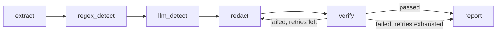

# RedactGuard

PII redaction for PDF/DOCX documents that doesn't just redact — it **verifies
the redaction actually worked** by re-extracting the output and checking
nothing sensitive survived, looping back to redaction automatically if it
did. Most redaction tools trust the redaction step blindly; this one treats
that trust as the actual bug to design around.

**Live demo:** not yet deployed — see [demo/README_SPACE.md](demo/README_SPACE.md) to deploy to Hugging Face Spaces (a few minutes, needs your own free HF account). Once deployed, put the link here.
**[Implementation guide](docs/IMPLEMENTATION_GUIDE.md)** — full design rationale, written before any code.

## Why this exists

A naive PDF redactor draws a black rectangle over sensitive text. It looks
correct. The text underneath is still there — fully selectable, copyable,
and extractable by anyone who opens the file. This is a well-known, real
failure mode, not a hypothetical: the difference between `page.draw_rect()`
and `page.add_redact_annot()` + `page.apply_redactions()` is one line of
code and produces two files that look identical to the human eye.

RedactGuard's actual contribution is closing that gap: after redaction, it
re-extracts the output file and confirms none of the originally-flagged
text is still recoverable. If it is, the document is sent back through
redaction automatically (capped retries), and only flagged for manual
review if it still fails. This is measured directly — see
[Verification catch rate](#eval-results-phase-2) below.

## Architecture



- **Extraction** (`app/extraction/`) — PyMuPDF for PDFs (word-level bounding
  boxes, not just text), python-docx→PDF conversion for DOCX (redaction
  needs one coordinate system, not two), pytesseract for scanned pages,
  auto-detected per page.
- **Detection** (`app/detection/`) — a fast regex pass for structured IDs
  (emails, PAN, Aadhaar-shaped numbers, IFSC, phone numbers) plus an LLM
  pass (Gemini primary, Groq fallback) for context-dependent PII regex
  can't shape-match: names, indirect references ("the promoter's spouse"),
  addresses.
- **Redaction** (`app/redaction/`) — PyMuPDF's true redaction API
  (`add_redact_annot` + `apply_redactions`), which strips the underlying
  text object rather than drawing over it.
- **Verification** (`app/verification/`) — re-extracts the redacted output
  and diffs it against the originally-flagged text.
- **Orchestration** (`app/graph/`) — a LangGraph `StateGraph` wires the
  above into a pipeline where verification failure is a real graph edge
  back to redaction (capped at `MAX_REDACT_RETRIES`), not a `while` loop
  buried in a function — explicit, loggable, and easy to reason about.

Phase 3 (below) replaces the LLM detection node with a fine-tuned local
model behind the *same interface*, so the swap is one import change in
`graph/pipeline_graph.py`, not a rewrite.

## Eval results (Phase 2)

Precision/recall/F1 measured against a synthetic labeled set (ground-truth
spans generated at data-creation time, not re-detected — re-detecting and
calling that "evaluation" would be circular). Generation uses a **different
model** than detection (Groq for generation, Gemini for detection, by
default) specifically so the eval isn't just the detector agreeing with
itself.

Reproduce with:
```bash
python -m eval.generate_synthetic_data --n 50
python -m eval.run_eval
```

Measured on 37 synthetic documents (`eval/results_phase1.json`, generated
2026-09-02):

| Metric | Value |
|---|---|
| Precision | 0.798 |
| Recall | 0.946 |
| F1 | 0.865 |
| Verification catch rate | 1.000 (7/7 deliberately-broken cases caught) |
| False alarm rate | 0.000 (0/30 clean cases incorrectly flagged) |
| Human-review rate | 0.811 |

The **verification catch rate** is the project's differentiating number: it
measures whether the verifier actually catches deliberately-broken
redactions (an overlay-only "fake" redaction injected in ~15% of eval runs
via `redact_pdf(..., simulate_failure=True)`), not just whether detection
found the right spans. 1.000 here means every single simulated redaction
failure in this run was correctly caught, with zero false alarms on the
genuinely-clean cases.

Worth being upfront about in this run: the last few documents hit Groq's
free-tier daily token limit mid-run (both Gemini and Groq are shared across
a lot of testing during development) - the pipeline's fallback and
per-chunk try/except caught this and degraded to regex-only detection for
those chunks instead of crashing the whole eval run, which is the exact
resilience behavior `llm_detector.py` is designed for, observed under real
rate-limiting rather than only in a unit test. This likely cost a small
amount of recall on those specific documents (fewer name/indirect-reference
spans caught) rather than reflecting the detector's normal-conditions
performance - re-running on a fresh quota would be expected to score
slightly higher.

`eval/results_phase1.json`'s `per_doc_detection` currently stores per-document
tp/fp/fn counts, not the individual false-positive/false-negative span
texts - a natural next improvement to make the precision number fully
self-explanatory would be logging the actual mismatched spans per document,
not just the counts.

## Quickstart

```bash
python -m venv .venv
.venv\Scripts\activate        # Windows; source .venv/bin/activate on Mac/Linux
pip install -r requirements.txt
cp .env.example .env          # fill in GEMINI_API_KEY and GROQ_API_KEY
```

Also install the Tesseract OCR **binary** (not just the Python wrapper) if
you'll process scanned documents — this is the most common setup failure.
Windows: UB-Mannheim build, add to PATH. Mac: `brew install tesseract`.
Linux: `apt install tesseract-ocr`. Verify with `tesseract --version`.

```bash
# CLI
python -m app.main --file path/to/document.pdf

# API
uvicorn app.api:app --reload
# POST a file to http://localhost:8000/redact

# Demo UI
streamlit run demo/app.py
```

### Docker

```bash
docker compose up --build
```

### Tests

```bash
pytest tests/ -v
```
CI (`.github/workflows/ci.yml`) runs the full suite on every push; the one
test that needs live API keys skips itself automatically when they're
absent (as they are in CI).

## Project structure

```
app/
├── extraction/       # PDF/DOCX/OCR -> ExtractedDocument (text + bboxes)
├── detection/         # regex + LLM (Phase 1) + local fine-tuned model (Phase 3)
├── redaction/         # true PyMuPDF redaction
├── verification/      # re-extract + diff the output
├── graph/              # LangGraph orchestration
├── report/             # JSON + Markdown report generation
├── api.py              # FastAPI wrapper (upload validation, /redact, /download)
└── main.py             # CLI entrypoint
eval/                   # synthetic data generation, metrics, eval harness
phase3_finetune/        # SFT/DPO dataset prep, Colab training scripts, adapter export
demo/                   # Streamlit demo UI (deployable to Hugging Face Spaces)
tests/                  # pytest suite
```

## Phase 3 — fine-tuning (optional, runs on Google Colab)

Phase 1/2 above are complete and runnable end to end with no GPU. Phase 3
replaces the API-based LLM detector with a small locally fine-tuned model
(Qwen2.5-0.5B-Instruct, QLoRA), trained via SFT then DPO on a free-tier
Colab T4 GPU — CPU inference afterward, so sensitive documents never leave
the machine once this node is swapped in.

```bash
python -m phase3_finetune.prepare_sft_dataset
python -m phase3_finetune.prepare_dpo_dataset
# upload data/sft_train.jsonl, data/dpo_pairs.jsonl to Colab, run
# phase3_finetune/colab_sft_train.py then colab_dpo_train.py
python -m phase3_finetune.export_adapter <downloaded-adapter.zip>
```

Then swap the detector in `app/graph/pipeline_graph.py`:
```python
from app.detection.local_model_detector import detect_local_model_spans as detect_llm_spans
```
Re-run `eval/run_eval.py` unchanged and compare `results_phase1.json` vs
`results_phase3.json` — that comparison table (precision/recall/F1, latency,
offline capability) is the actual Phase 3 deliverable, not the training run.

**Honest limitation:** the API-model detector performs open-ended
extraction ("find all sensitive spans in this text"). The fine-tuned model
was trained as a classifier on a `(context, span)` pair, so it can't
propose spans on its own — `local_model_detector.py` uses a lightweight
candidate-span heuristic ahead of classification, which will under-propose
relative to the API model's free-form extraction. This tradeoff is exactly
what the Phase 1 vs Phase 3 comparison table is meant to surface honestly.

## Known limitations

- Detection is evaluated on synthetic document excerpts (~300 words); very
  long real documents (50+ page filings) are chunked per-page for the LLM
  call, but end-to-end accuracy on genuinely long documents hasn't been
  separately measured.
- DOCX redaction converts to PDF first and redacts that — output for a
  DOCX input is a redacted PDF, not a redacted DOCX, by design (see
  `app/extraction/docx_extractor.py`).
- The synthetic eval set is small (tens, not thousands, of documents) —
  enough to get real, honest numbers, not enough to claim statistical
  rigor at production scale.

## License

MIT — see [LICENSE](LICENSE).
